# BookEx Entity Relationship Diagram (ERD)

This document contains the Entity Relationship Diagram for the BookEx application, showing all database entities and their relationships.

## ERD Diagram

```mermaid
erDiagram
    User ||--o{ Book : "owns/sells"
    User ||--o{ Review : "writes"
    User ||--o{ Review : "receives"
    User ||--o{ Report : "files"
    User ||--o{ Report : "reported"
    User ||--o{ Exchange : "proposes"
    User ||--o{ Exchange : "responds"
    User ||--o{ Notification : "receives"
    User ||--o{ WishlistItem : "has"
    User ||--o{ Message : "sends"
    User }o--o{ Community : "member of"
    User ||--o{ Post : "creates"
    User ||--o{ Comment : "writes"
    User ||--o{ ChatMessage : "sends"
    User ||--o{ ModerationAction : "performs"
    User ||--o{ Organization : "submits"
    User ||--o{ PasswordResetToken : "requests"
    User }o--o{ Organization : "represents"
    User ||--o{ Donation : "donates"
    
    Book ||--o{ Exchange : "offered"
    Book ||--o{ Exchange : "requested"
    Book ||--o{ WishlistItem : "added to"
    Book ||--o{ Chat : "discussed in"
    
    Community ||--o{ Post : "contains"
    Community ||--o{ Channel : "has"
    Community ||--o{ CommunityMember : "has"
    
    Channel ||--o{ ChatMessage : "contains"
    
    Post ||--o{ Comment : "has"
    
    Exchange ||--|| Chat : "linked to"
    Exchange ||--o{ ExchangeStatusUpdate : "tracks"
    
    Donation ||--|| Chat : "linked to"
    Donation ||--|| Organization : "receives"
    Donation ||--o{ DonationStatusUpdate : "tracks"
    Donation ||--o{ DonationBook : "contains"
    
    Chat ||--o{ Message : "contains"
    Chat ||--o{ User : "participates"
    Chat ||--o| Book : "about"
    Chat ||--o| Organization : "about"
    Chat ||--o| Exchange : "about"
    Chat ||--o| Donation : "about"
    
    Report ||--o| Book : "reports"
    Report ||--o| User : "reports"
    Report ||--o| Post : "reports"
    Report ||--o| Comment : "reports"
    Report ||--o| Community : "reports"
    
    ModerationAction ||--o| User : "targets"
    ModerationAction ||--o| Book : "targets"
    ModerationAction ||--o| Post : "targets"
    ModerationAction ||--o| Comment : "targets"
    
    AdminNotification ||--o| User : "relates to"
    AdminNotification ||--o| Book : "relates to"
    AdminNotification ||--o| Organization : "relates to"
    AdminNotification ||--o| Report : "relates to"
    
    ContentFilter ||--|| User : "created by"

    User {
        ObjectId _id PK
        string name
        string username UK
        string email UK
        string password
        string avatarUrl
        string city
        string phone
        string bio
        array interests
        string birthDate
        int reviews
        int totalRatingPoints
        float averageRating
        enum role
        enum status
        bool profileCompleted
        string createdAt
        string updatedAt
        object emailPreferences
        array communities FK
    }
    
    Book {
        ObjectId _id PK
        string title
        string author
        float price
        enum condition
        string imageUrl
        string sellerId FK
        string city
        enum type
        string description
        enum genre
        enum status
        string createdAt
        string updatedAt
        string expiresAt
        string titleNormalized
        string authorNormalized
        string duplicateHash
    }
    
    WishlistItem {
        string bookId FK
        string addedAt
    }
    
    Community {
        ObjectId _id PK
        string name
        string description
        int memberCount
        string imageUrl
        array members
        array channels
        array posts
        string createdBy FK
    }
    
    CommunityMember {
        string userId FK
        enum role
        string joinedAt
        bool banned
        string banReason
        string bannedAt
    }
    
    Channel {
        string _id PK
        string name
        enum type
        string description
        int order
        string createdAt
    }
    
    Post {
        ObjectId _id PK
        string authorId FK
        object author
        string content
        string communityId FK
        int likes
        array likedBy
        array comments
        int commentCount
        string createdAt
        string editedAt
        array editHistory
    }
    
    Comment {
        ObjectId _id PK
        object author
        string content
        string createdAt
        string editedAt
        string postId FK
        string parentId FK
        string path
        array reactions
        array editHistory
    }
    
    ChatMessage {
        ObjectId _id PK
        string channelId FK
        object author
        string content
        string createdAt
        string editedAt
        array reactions
        array editHistory
    }
    
    Exchange {
        ObjectId _id PK
        string proposerId FK
        string responderId FK
        ObjectId proposerBookId FK
        ObjectId responderBookId FK
        enum status
        array statusHistory
        ObjectId chatId FK
        string proposedAt
        string acceptedAt
        string completedAt
        string updatedAt
        string proposalMessage
        string meetingLocation
        bool proposerConfirmed
        bool responderConfirmed
        int proposerRating
        int responderRating
        string proposerReview
        string responderReview
    }
    
    ExchangeStatusUpdate {
        enum status
        string timestamp
        string updatedBy FK
        string notes
    }
    
    Chat {
        ObjectId _id PK
        array participantIds FK
        ObjectId bookId FK
        ObjectId organizationId FK
        ObjectId exchangeId FK
        ObjectId donationId FK
        string lastMessage
        string updatedAt
        array messages
    }
    
    Message {
        ObjectId _id PK
        string senderId FK
        string text
        string content
        string createdAt
        bool read
        string readAt
    }
    
    Review {
        ObjectId _id PK
        string reviewerId FK
        string revieweeId FK
        int rating
        string comment
        string createdAt
    }
    
    Report {
        ObjectId _id PK
        string reporterId FK
        string reportedUserId FK
        string reportedContentId FK
        enum reportedContentType
        string reason
        string details
        string description
        string reporterName
        enum status
        string createdAt
        string resolvedAt
        string resolvedBy FK
        string resolutionNotes
        enum severity
    }
    
    ModerationAction {
        ObjectId _id PK
        string moderatorId FK
        enum actionType
        string targetUserId FK
        string targetContentId FK
        enum targetContentType
        string reason
        int duration
        string createdAt
        string expiresAt
    }
    
    Organization {
        ObjectId _id PK
        string name
        string description
        string imageUrl
        string location
        enum status
        string submittedBy FK
        string primaryContactId FK
        array representatives
        string createdAt
        string contactEmail
        string contactPhone
        string website
        string updatedAt
    }
    
    OrganizationRepresentative {
        string userId FK
        enum role
        string addedAt
        string addedBy FK
    }
    
    Donation {
        ObjectId _id PK
        string donorId FK
        ObjectId organizationId FK
        ObjectId chatId FK
        array books
        enum status
        array statusHistory
        string pickupDate
        string pickupLocation
        enum deliveryMethod
        bool orgConfirmed
        string orgConfirmedAt
        string createdAt
        string updatedAt
        string notes
        string receivedDate
        string receivedCondition
        string receiptNotes
        string confirmedBy FK
        string completedAt
        string lastUpdatedBy FK
    }
    
    DonationBook {
        ObjectId bookId FK
        string title
        string author
        enum condition
        int quantity
        string notes
    }
    
    DonationStatusUpdate {
        enum status
        string timestamp
        string updatedBy FK
        string notes
    }
    
    Notification {
        ObjectId _id PK
        string userId FK
        enum type
        string title
        string message
        string link
        bool read
        string createdAt
        object metadata
    }
    
    AdminNotification {
        ObjectId _id PK
        enum type
        enum priority
        string title
        string message
        string details
        string actionUrl
        bool read
        bool resolved
        string resolvedAt
        string resolvedBy FK
        object metadata
        string createdAt
        string updatedAt
        string expiresAt
    }
    
    PasswordResetToken {
        ObjectId _id PK
        string userId FK
        string token UK
        string expiresAt
        bool used
        string createdAt
    }
    
    ContentFilter {
        ObjectId _id PK
        string pattern
        enum type
        enum severity
        enum action
        bool isActive
        string createdBy FK
        string createdAt
        int matchCount
    }
```

## Entity Descriptions

### Core Entities

#### User
The central entity representing all users in the system. Users can be buyers, sellers, community members, and administrators.

**Key Relationships:**
- Owns/sells books
- Participates in exchanges
- Creates and receives reviews
- Files and can be reported
- Member of communities
- Creates posts and comments

#### Book
Represents books available for sale or exchange.

**Key Relationships:**
- Owned by users
- Can be proposed or requested in exchanges
- Added to wishlists
- Discussed in chats

#### Community
User-created groups for book discussions and exchanges.

**Key Relationships:**
- Has members (users)
- Contains posts
- Has channels for organized discussions

### Transaction Entities

#### Exchange
Manages book exchanges between users, tracking the entire lifecycle from proposal to completion.

**Key Relationships:**
- Links two users (proposer and responder)
- Links two books being exchanged
- Connected to a chat for communication
- Tracks status updates

#### Chat
Messaging system for user communications about books, exchanges, or organizations.

**Key Relationships:**
- Between multiple participants (users)
- Can reference a book, organization, or exchange
- Contains messages

### Moderation Entities

#### Report
User-generated reports for inappropriate content or behavior.

**Key Relationships:**
- Filed by a user
- Can target users, books, posts, comments, or communities

#### ModerationAction
Admin/moderator actions taken on content or users.

**Key Relationships:**
- Performed by a user (moderator/admin)
- Targets users or content

#### ContentFilter
Automated content filtering rules.

### Supporting Entities

#### Review
User ratings and feedback for other users.

#### Notification
System notifications for users about various events.

#### AdminNotification
Special notifications for administrators about system events.

#### Organization
Educational or business organizations that can be associated with users.

#### PasswordResetToken
Temporary tokens for password reset functionality.

## Cardinality Legend

- `||--o{` : One to many (1:N)
- `||--||` : One to one (1:1)
- `}o--o{` : Many to many (M:N)
- `||--o|` : One to zero or one (1:0..1)

## Indexes and Performance

Key indexes should be created on:
- User: email, username, city, communities
- Book: sellerId, city, genre, status, titleNormalized, authorNormalized, duplicateHash
- Exchange: proposerId, responderId, status, chatId
- Community: members.userId, createdBy
- Post: communityId, authorId
- Chat: participantIds, bookId, exchangeId
- Report: reporterId, reportedUserId, status
- Notification: userId, read, createdAt

## Notes

1. **Timestamps**: Most entities use ISO 8601 date strings (UTC) for timestamps
2. **ObjectId vs String**: MongoDB ObjectIds are used for primary keys, but foreign keys may be strings
3. **Embedded vs Referenced**: Some data (like author info in posts) is embedded for performance
4. **Status Tracking**: Many entities have status fields for lifecycle management
5. **Soft Delete**: Entities use status fields rather than hard deletes for data integrity
