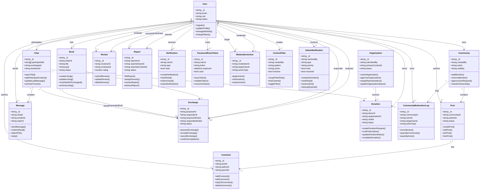

```mermaid
classDiagram
    class User {
        +string _id
        +string email
        +string role
        +string status
        +register()
        +updateProfile()
        +manageWishlist()
        +changeStatus()
    }

    class Book {
        +string _id
        +string sellerId
        +string title
        +string type
        +string status
        +createListing()
        +updateListing()
        +markSoldOrExchanged()
        +archiveListing()
    }

    class Community {
        +string _id
        +string createdBy
        +string name
        +string visibility
        +addMember()
        +removeMember()
        +approveJoinRequest()
        +transferOwnership()
    }

    class Post {
        +string _id
        +string communityId
        +string authorId
        +string status
        +createPost()
        +editPost()
        +pinPost()
        +lockPost()
    }

    class Comment {
        +string _id
        +string postId
        +string authorId
        +string parentId
        +addComment()
        +editComment()
        +replyToComment()
        +deleteComment()
    }

    class Organization {
        +string _id
        +string submittedBy
        +string primaryContactId
        +string status
        +submitApplication()
        +approveOrganization()
        +assignRepresentative()
        +updateOrganizationStatus()
    }

    class Chat {
        +string _id
        +string[] participantIds
        +string exchangeId
        +string donationId
        +openChat()
        +addParticipantContext()
        +updateLastMessage()
        +archiveForUser()
    }

    class Message {
        +string _id
        +string chatId
        +string senderId
        +string replyTo
        +sendMessage()
        +markAsRead()
        +attachFile()
        +reply()
    }

    class Exchange {
        +string _id
        +string proposerId
        +string responderId
        +string proposerBookId
        +string responderBookId
        +string status
        +proposeExchange()
        +acceptExchange()
        +cancelExchange()
        +confirmCompletion()
    }

    class Donation {
        +string _id
        +string donorId
        +string organizationId
        +string chatId
        +string status
        +createDonationRequest()
        +confirmDonation()
        +updateDonationStatus()
        +completeDonation()
    }

    class Review {
        +string _id
        +string reviewerId
        +string revieweeId
        +number rating
        +submitReview()
        +updateReview()
        +deleteReview()
    }

    class Report {
        +string _id
        +string reporterId
        +string reportedUserId
        +string reportedContentId
        +string status
        +fileReport()
        +assignSeverity()
        +resolveReport()
        +dismissReport()
    }

    class Notification {
        +string _id
        +string userId
        +string type
        +bool read
        +createNotification()
        +markRead()
        +markUnread()
        +expireNotification()
    }

    class PasswordResetToken {
        +string _id
        +string userId
        +string token
        +datetime expiresAt
        +bool used
        +issueToken()
        +validateToken()
        +consumeToken()
    }

    class ModerationAction {
        +string _id
        +string moderatorId
        +string targetUserId
        +string actionType
        +applyAction()
        +setDuration()
        +expireAction()
    }

    class ContentFilter {
        +string _id
        +string createdBy
        +string pattern
        +string action
        +bool isActive
        +createFilterRule()
        +testContent()
        +toggleFilter()
    }

    class CommunityModerationLog {
        +string _id
        +string communityId
        +string actorId
        +string targetUserId
        +string actionType
        +recordAction()
        +queryByCommunity()
        +queryByActor()
    }

    class AdminNotification {
        +string _id
        +string resolvedBy
        +string type
        +string priority
        +bool read
        +bool resolved
        +createAdminAlert()
        +markRead()
        +resolveAlert()
        +cleanupExpired()
    }

    User "1" --> "0..*" Book : lists
    User "*" --> "*" Community : joins
    Community "1" --> "0..*" Post : contains
    Post "1" --> "0..*" Comment : has

    User "1" --> "0..*" Post : authors
    User "1" --> "0..*" Comment : authors

    User "*" --> "*" Chat : participates
    Chat "1" --> "0..*" Message : contains
    User "1" --> "0..*" Message : sends

    User "1" --> "0..*" Exchange : proposer
    User "1" --> "0..*" Exchange : responder
    Book "1" --> "0..*" Exchange : proposerBook
    Book "1" --> "0..*" Exchange : responderBook
    Chat "1" --> "0..1" Exchange : linked

    User "1" --> "0..*" Donation : donor
    Organization "1" --> "0..*" Donation : receiver
    Chat "1" --> "0..1" Donation : linked

    User "1" --> "0..*" Review : reviewer
    User "1" --> "0..*" Review : reviewee

    User "1" --> "0..*" Report : reporter
    User "1" --> "0..*" Report : reportedUser

    User "1" --> "0..*" Notification : receives
    User "1" --> "0..*" PasswordResetToken : owns

    User "1" --> "0..*" ModerationAction : moderator
    User "1" --> "0..*" ModerationAction : target
    User "1" --> "0..*" ContentFilter : creates

    Community "1" --> "0..*" CommunityModerationLog : logs
    User "1" --> "0..*" CommunityModerationLog : actor

    User "1" --> "0..*" AdminNotification : resolves
```
