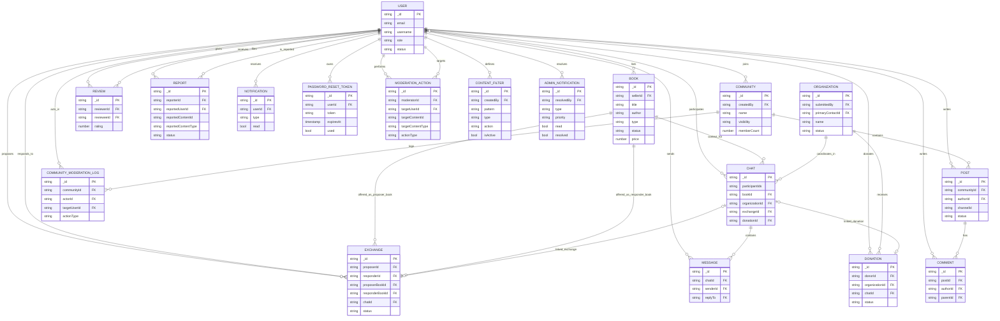

```mermaid
erDiagram
    USER {
        string _id PK
        string email
        string username
        string role
        string status
    }

    BOOK {
        string _id PK
        string sellerId FK
        string title
        string author
        string type
        string status
        number price
    }

    COMMUNITY {
        string _id PK
        string createdBy FK
        string name
        string visibility
        number memberCount
    }

    POST {
        string _id PK
        string communityId FK
        string authorId FK
        string channelId
        string status
    }

    COMMENT {
        string _id PK
        string postId FK
        string authorId FK
        string parentId FK
    }

    ORGANIZATION {
        string _id PK
        string submittedBy FK
        string primaryContactId FK
        string name
        string status
    }

    CHAT {
        string _id PK
        string participantIds
        string bookId FK
        string organizationId FK
        string exchangeId FK
        string donationId FK
    }

    MESSAGE {
        string _id PK
        string chatId FK
        string senderId FK
        string replyTo FK
    }

    EXCHANGE {
        string _id PK
        string proposerId FK
        string responderId FK
        string proposerBookId FK
        string responderBookId FK
        string chatId FK
        string status
    }

    DONATION {
        string _id PK
        string donorId FK
        string organizationId FK
        string chatId FK
        string status
    }

    REVIEW {
        string _id PK
        string reviewerId FK
        string revieweeId FK
        number rating
    }

    REPORT {
        string _id PK
        string reporterId FK
        string reportedUserId FK
        string reportedContentId
        string reportedContentType
        string status
    }

    NOTIFICATION {
        string _id PK
        string userId FK
        string type
        bool read
    }

    PASSWORD_RESET_TOKEN {
        string _id PK
        string userId FK
        string token
        timestamp expiresAt
        bool used
    }

    MODERATION_ACTION {
        string _id PK
        string moderatorId FK
        string targetUserId FK
        string targetContentId
        string targetContentType
        string actionType
    }

    CONTENT_FILTER {
        string _id PK
        string createdBy FK
        string pattern
        string type
        string action
        bool isActive
    }

    COMMUNITY_MODERATION_LOG {
        string _id PK
        string communityId FK
        string actorId FK
        string targetUserId FK
        string actionType
    }

    ADMIN_NOTIFICATION {
        string _id PK
        string resolvedBy FK
        string type
        string priority
        bool read
        bool resolved
    }

    USER ||--o{ BOOK : lists
    USER ||--o{ POST : writes
    USER ||--o{ COMMENT : writes
    USER ||--o{ MESSAGE : sends
    USER ||--o{ REVIEW : gives
    USER ||--o{ REVIEW : receives
    USER ||--o{ REPORT : files
    USER ||--o{ REPORT : is_reported
    USER ||--o{ NOTIFICATION : receives
    USER ||--o{ PASSWORD_RESET_TOKEN : owns
    USER ||--o{ EXCHANGE : proposes
    USER ||--o{ EXCHANGE : responds_to
    USER ||--o{ DONATION : donates
    USER ||--o{ MODERATION_ACTION : performs
    USER ||--o{ MODERATION_ACTION : targets
    USER ||--o{ CONTENT_FILTER : defines
    USER ||--o{ COMMUNITY_MODERATION_LOG : acts_in
    USER ||--o{ ADMIN_NOTIFICATION : resolves

    USER }o--o{ COMMUNITY : joins
    USER }o--o{ CHAT : participates
    COMMUNITY ||--o{ POST : contains
    POST ||--o{ COMMENT : has
    COMMUNITY ||--o{ COMMUNITY_MODERATION_LOG : logs

    BOOK ||--o{ EXCHANGE : offered_as_proposer_book
    BOOK ||--o{ EXCHANGE : offered_as_responder_book
    BOOK ||--o{ CHAT : context_for

    ORGANIZATION ||--o{ DONATION : receives
    ORGANIZATION ||--o{ CHAT : coordinates_in

    CHAT ||--o{ MESSAGE : contains
    CHAT o|--o| EXCHANGE : linked_exchange
    CHAT o|--o| DONATION : linked_donation
```
